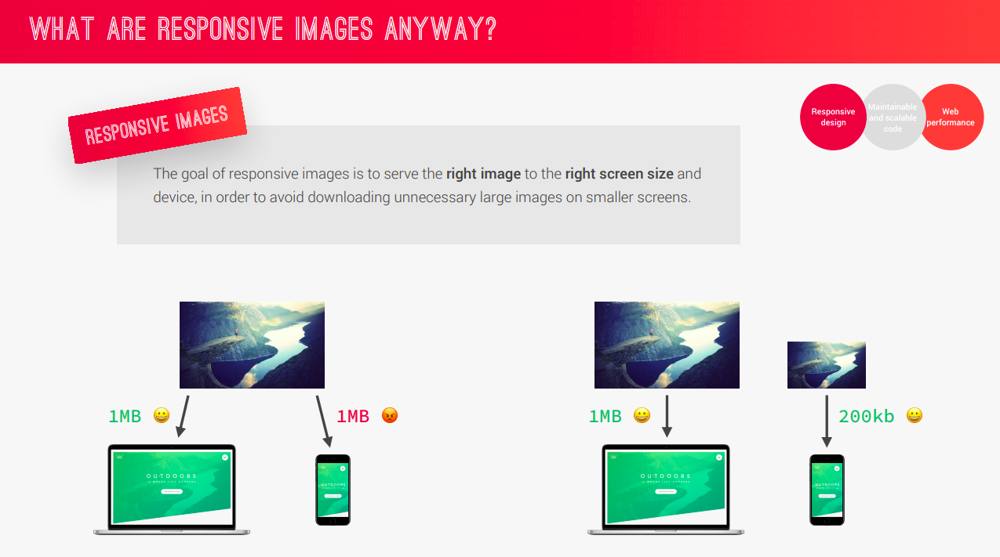

# Responsive images


## Art direction & Density Switching
```html
<div class="footer__logo-box">
        <picture class="footer__logo">
          <source
            srcset="./img/logo-green-small-1x.png 1x, ./img/logo-green-small-2x.png 2x"
            media="(max-width:37.5rem)" />
                
          
        </picture>
      </div>
```
## Density & Resolution Switching
```html

```
